<h1 align=center>节日主题更换说明</h1>

## 目录
- [目录](#目录)
- [一.功能实现](#一功能实现)
  - [1. 基础控制类](#1-基础控制类)
    - [1.1 FestiveAirManager](#11-festiveairmanager)
    - [1.2 FestiveAirType](#12-festiveairtype)
    - [1.3 IFestiveAirChange](#13-ifestiveairchange)
  - [2. 所有组件](#2-所有组件)
    - [2.1 FestiveAirComponent](#21-festiveaircomponent)
    - [2.2 FestiveAirLoadPrefabComponent](#22-festiveairloadprefabcomponent)
    - [2.3 FestiveAirSpriteChangeComponent](#23-festiveairspritechangecomponent)
    - [2.4 FestiveAirRenderColorChangeComponent](#24-festiveairrendercolorchangecomponent)
    - [2.5 FestiveTMPMatChangeComponent](#25-festivetmpmatchangecomponent)
- [二.操作说明](#二操作说明)
  - [1.新节日资源存放说明](#1新节日资源存放说明)
  - [2.组件使用](#2组件使用)
  - [2.1 FestiveAirComponent](#21-festiveaircomponent-1)
  - [2.2 FestiveAirLoadPrefabComponent](#22-festiveairloadprefabcomponent-1)
- [](#)
  - [2.3 FestiveAirSpriteChangeComponent](#23-festiveairspritechangecomponent-1)
  - [2.4 FestiveAirRenderColorChangeComponent](#24-festiveairrendercolorchangecomponent-1)
  - [2.5 FestiveTMPMatChangeComponent](#25-festivetmpmatchangecomponent-1)
- [三.最终效果](#三最终效果)

## 一.功能实现

```
1.该功能考虑到替换的位置可能涉及到很多面板，所以写成了组件化的模式。
2.由于游戏最开始位置就会调用，所以管理脚本自己为一个单例，在调用时创建。
```

### 1. 基础控制类

* FestiveAirManager =>节日主题管理类
* FestiveAirType =>节日类型集合
* IFestiveAirChange =>属性替换类型组件统一接口，除显示隐藏控制外的组件
  
#### 1.1 FestiveAirManager

* 控制流程如下

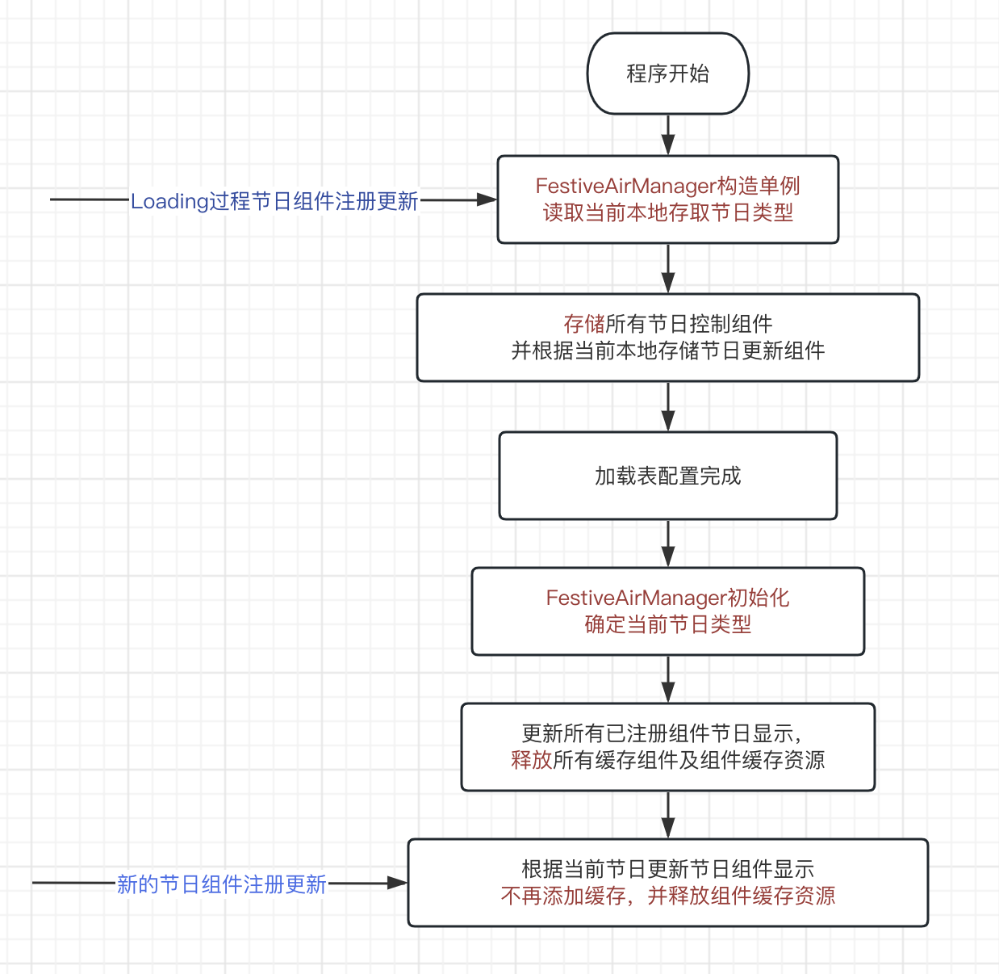

* 主要包含两个集合
```
// 显示隐藏节点集合，根据节日类型区分
private Dictionary<FestiveAirTypeList<FestiveAirComponent>> mFestiveAirDic 
  = new Dictionary<FestiveAirType, List<FestiveAirComponent>>();

// 所有要替换属性的节点集合
private List<IFestiveAirChange> mFestiveAirChangeList 
  = new List<IFestiveAirChange>();
```
* 集合对应管理方法
```
//注册指定节日显示隐藏节点组件
public void RegisterFestiveNode(FestiveAirType type, FestiveAirComponent component)

//移除指定节日显示隐藏节点组件
public void RemoveFestiveNode(FestiveAirType type, FestiveAirComponent component)

//注册节日替换图片组件
public void RegisterFestiveChangeNode(IFestiveAirChange component)

//移除节日替换图片组件
public void RemoveFestiveSpriteChangeNode(IFestiveAirChange component)
```

#### 1.2 FestiveAirType
```
public enum FestiveAirType
{
    Default = 0,        //默认
    Halloween           //万圣节
}
```

#### 1.3 IFestiveAirChange
```
public interface IFestiveAirChange
{
  //更新节日显示接口
  public void UpdateFestiveAir(FestiveAirType curType);
  //移除缓存资源接口
  public void ReleaseCacheResources();
}
```

### 2. 所有组件

* FestiveAirComponent =>根据节日类型控制节点显示隐藏
* FestiveAirLoadPrefabComponent =>根据名字加节日名控制加载预制体到子节点
* FestiveAirSpriteChangeComponent =>替换Image或SpriteRenderer的Sprite图
* FestiveAirRenderColorChangeComponent =>改变继承Renderer组件的颜色
* FestiveTMPMatChangeComponent =>切换材质

#### 2.1 FestiveAirComponent

本想直接使用枚举设置类型，枚举报错就改成使用int强转枚举，在Awake中注册监听，在Destroy中移除监听，在管理类中释放缓存的时候会直接销毁该gameObject。
```
    public class FestiveAirComponent : MonoBehaviour
    {
        [Header("节日类型： 0-default  1-halloween")]
        public int festiveInt = 0;
        private FestiveAirType mFestiveType;

        private void Awake()
        {
            mFestiveType = (FestiveAirType) festiveInt;
            FestiveAirManager.Instance.RegisterFestiveNode(mFestiveType, this);
        }

        private void OnDestroy()
        {
            FestiveAirManager.Instance.RemoveFestiveNode(mFestiveType, this);
        }

        public void UpdateFestive(FestiveAirType curType)
        {
            gameObject.SetActive(curType == mFestiveType);
        }
    }
```
#### 2.2 FestiveAirLoadPrefabComponent

继承IFestiveAirChange接口
```
public class FestiveAirLoadPrefabComponent : MonoBehaviour, IFestiveAirChange
```
定义了两个关键属性，mDefaultPrefabName为默认加载资源预设名称，如果当前在节日时间会加载mDefaultPrefabName+FestiveType名称的预设，预设加载的资源不存在会加载默认资源，加载后会设置在自身节点的子节点下
```
[SerializeField]
private string mDefaultPrefabName;
[SerializeField]
private bool mIsLoadSync = false;

public void UpdateFestiveAir(FestiveAirType curType)
{
  string loadPrefabName;
  if (curType != FestiveAirType.Default)
  {
    loadPrefabName = mDefaultPrefabName + curType.ToString();
  }
  else
  {
    loadPrefabName = mDefaultPrefabName;
  }
  string addressGuid = AAConst.GetUIAddress(loadPrefabName);
  if (addressGuid.IsNullOrEmpty())
  {
    addressGuid = AAConst.GetUIAddress(mDefaultPrefabName);
  }
  AAResourcesManager.LoadAssetAsync<GameObject>(addressGuid, (obj, address) => {...});
}
```

#### 2.3 FestiveAirSpriteChangeComponent

继承IFestiveAirChange接口
```
public class FestiveAirSpriteChangeComponent : MonoBehaviour, IFestiveAirChange
```
更换sprite支持Image和SpriteRenderer，在当前节日信息加载前（管理类初始化前），会同时缓存默认设置的sprite和动态加载的sprite，原因是默认状态不做变动，默认图片不放在动态加载目录下，只有在确定不再更换后才做释放。
```
private Image mThisImg;
private SpriteRenderer mThisSpriteRenderer;

private Sprite mDefaultSprite;  //默认sprite
private Sprite mCacheSprite;    //动态加载的sprite缓存
```
更新时会先释放掉之前动态加载的图片，节日替换图片名称为默认图片名称+“_节日名”。如果资源不存在会设置默认图片。
```
if (mThisImg == null && mThisSpriteRenderer == null) return;
if (mCacheSprite != null)
{
  AAResourcesManager.ReleaseAssetsRes(mCacheSprite);
}
if (curType != FestiveAirType.Default)
{
  var spriteName = mDefaultSprite.name + "_" + curType.ToString();
  string addressGuid = AAConst.GetUIAddress(spriteName);
  if (addressGuid.IsNotNullAndEmpty())
  {
    AAResourcesManager.LoadAssetAsync<Sprite>(addressGuid, (sprite, address) => {...});
  }
  else
  {
    if (mThisImg != null)
    {
      mThisImg.sprite = mDefaultSprite;
    }
    else if (mThisSpriteRenderer != null)
    {
      mThisSpriteRenderer.sprite = mDefaultSprite;
    }
  }
}
```

#### 2.4 FestiveAirRenderColorChangeComponent

继承IFestiveAirChange接口
```
public class FestiveAirRenderColorChangeComponent : MonoBehaviour, IFestiveAirChange
```
这部分设置需要手动修改，参数结构为结构体列表的形式
```
[Serializable]
public struct ColorData
{
    public int id;//节日类型索引
    public Color color;
}
[Header("Id代表节日 0-default 1-halloween")]
[SerializeField] private ColorData[] mColorDatas;
```
效果如下，id代表节日类型枚举对应的值，需要记录下默认值。

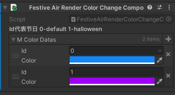

更换的时候会先设置回默认值，再遍历Datas数据找id和节日索引一致的数据修改属性
```
public void UpdateFestiveAir(FestiveAirType curType)
{
    if (mThisRenderer == null) return;
    if (mColorDatas == null || mColorDatas.Length == 0)
    {
        Debug.LogError("FestiveAir Color 默认值未设置");
        return;
    }
    mThisRenderer.material.color = mColorDatas[0].color;
    
    int curFestiveIndex = (int) curType;
    for (int i = 0; i < mColorDatas.Length; i++)
    {
        if (mColorDatas[i].id == curFestiveIndex)
        {
            mThisRenderer.material.color = mColorDatas[i].color;
            break;
        }
    }
}
```

#### 2.5 FestiveTMPMatChangeComponent

继承IFestiveAirChange接口
```
public class FestiveTMPMatChangeComponent : MonoBehaviour, IFestiveAirChange
```
这部分设置需要手动修改，参数结构为结构体列表的形式
```
[Serializable]
public struct MaterialData
{
    public int id;//节日类型索引
    public Material material;
}
[Header("索引代表节日 0-default 1-halloween")] [SerializeField]
private MaterialData[] mFontMaterialDatas;
```
效果如下，id代表节日类型枚举对应的值，需要记录下默认值。

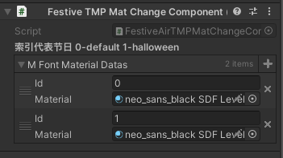

更换的时候会先设置回默认值，再遍历Datas数据找id和节日索引一致的数据修改属性
```
public void UpdateFestiveAir(FestiveAirType curType)
{
    if (mThisTxt == null) return;
    
    if (mFontMaterialDatas == null || mFontMaterialDatas.Length == 0)
    {
        Debug.LogError("FestiveAir Material 默认值未设置");
        return;
    }
    mThisTxt.fontMaterial = mFontMaterialDatas[0].material;
    int curFestiveIndex = (int) curType;
    for (int i = 0; i < mFontMaterialDatas.Length; i++)
    {
        if (mFontMaterialDatas[i].id == curFestiveIndex)
        {
            mThisTxt.fontMaterial = mFontMaterialDatas[i].material;
            break;
        }
    }
}
```

## 二.操作说明

### 1.新节日资源存放说明

主要涉及两部分资源，1是图片，2是预制体。

图片需要新建文件夹存放，由于可能存在动态加载的图片所以文件夹名称需要带有m_*_dl，如下图。

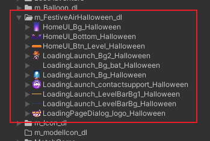

预制体同理，配置如图。

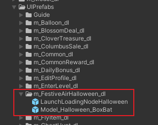

### 2.组件使用

### 2.1 FestiveAirComponent

在需要显示gameObject的地方新建对应游戏物体，并添加该组件，设置节日id即可。

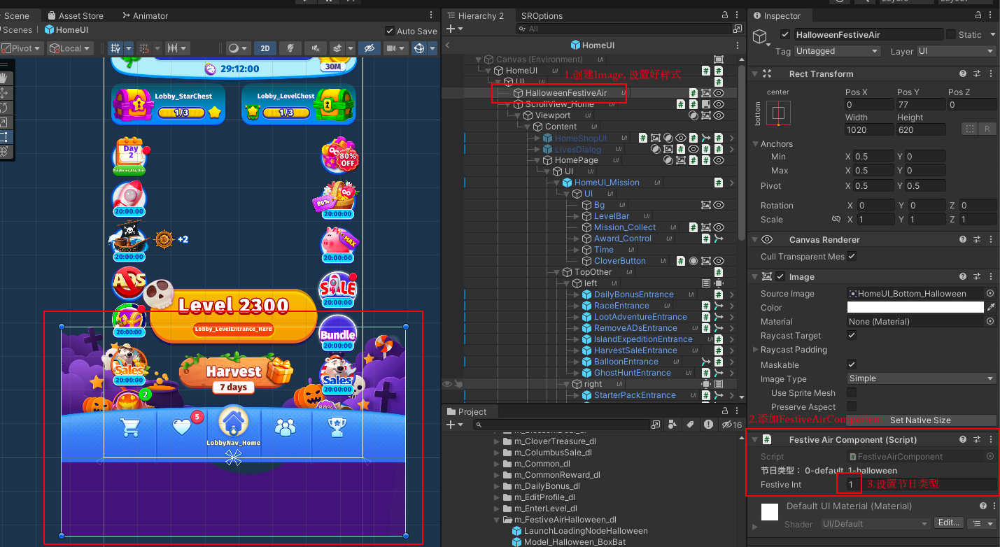

### 2.2 FestiveAirLoadPrefabComponent

这个组件适用于复杂结构的替换，默认物体在节日时候需要隐藏的情况，当然用FestiveAirComponent也可以实现类似功能，但是这个组件可以降低开始时的游戏内存。

举个例子，游戏Loading时候的背景图和游戏logo，结构可以整理到在一个节点下。

eg:

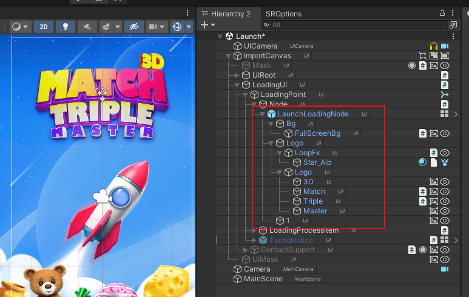

需要替换为


##

1. 这种情况下可以在父节点上绑定FestiveAirLoadPrefabComponent组件，并把默认名称加到参数当中，加载方式是否同步可以根据需要选择，由于Loading界面在游戏开始直接显示所以选择的同步加载。

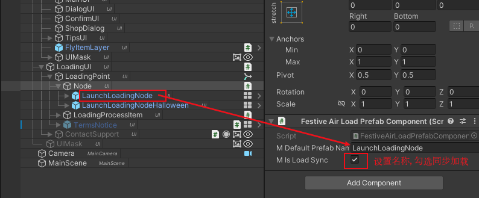

2. 之后需要把节日替换物体的名称修改为默认名称+节日名称（eg: LaunchLoadingNodeHalloween），将两个物体拖拽到对应的预制体位置

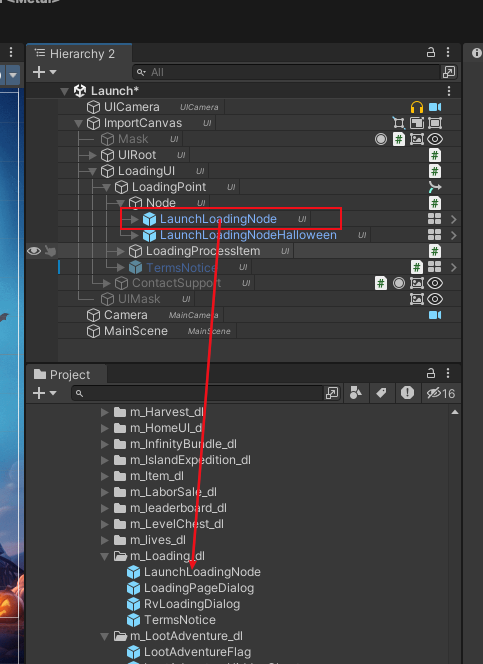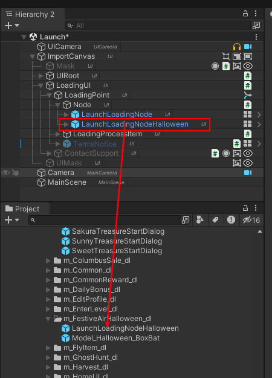

```
* 需要注意的是替换物体中不涉及代码引用和需要代码控制的节点
```

### 2.3 FestiveAirSpriteChangeComponent

这部分只是修改显示图片，不需要在意代码是否调用问题，只要把对应要替换的资源名称修改为默认图片名称加"_节日名称"即可（eg: ）

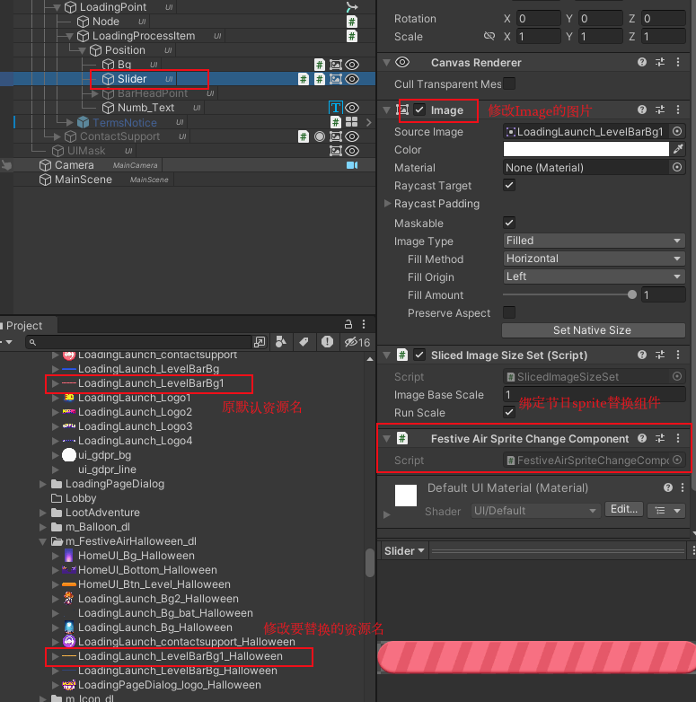

### 2.4 FestiveAirRenderColorChangeComponent

在需要替换模型或者3DSprite物品的颜色时可以使用该组件，主要就是在Renderer相关组件下添加FestiveAirRenderColorChangeComponent，一定要先设置默认颜色即id=0的颜色。之后再添加对应节日id要改变的颜色。

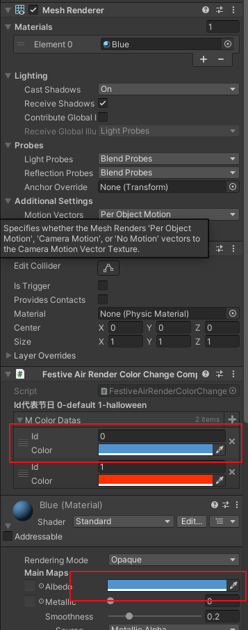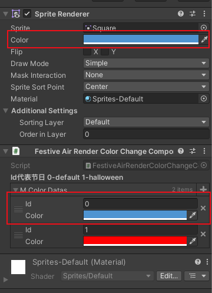

### 2.5 FestiveTMPMatChangeComponent

这个和颜色修改同理，用来修改TMP_Text组件的字体材质，需要先设置默认材质，再根据id设置节日需要替换的字体材质

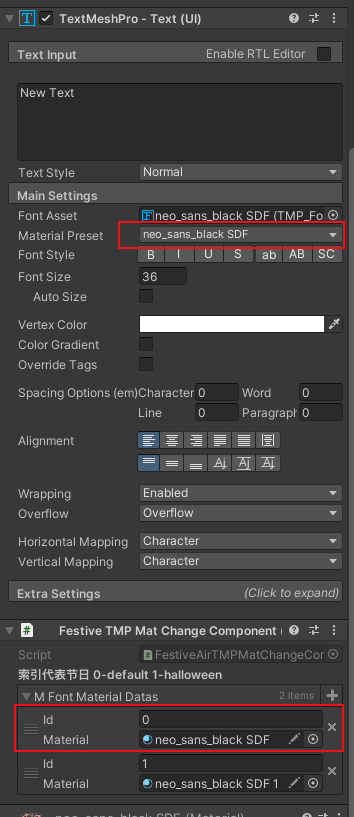

## 三.最终效果

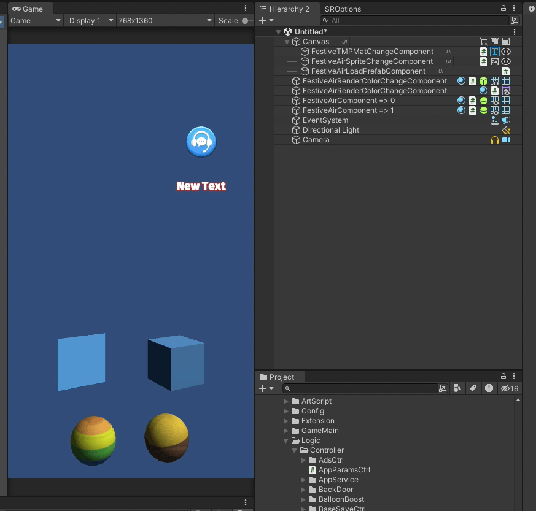