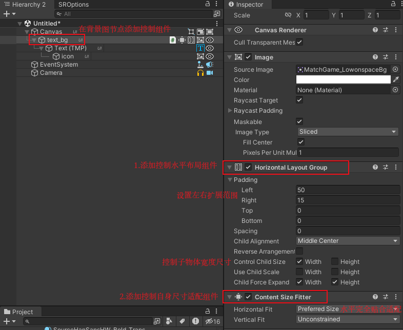
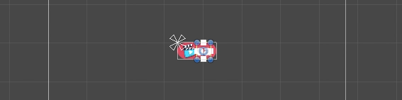
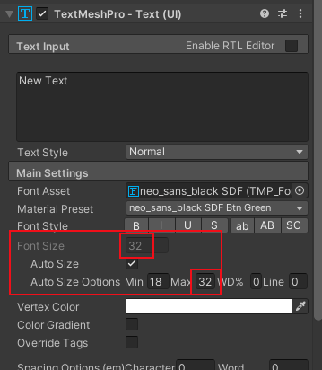
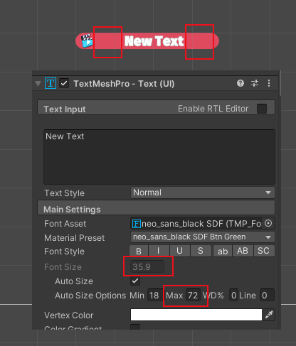
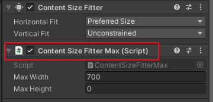
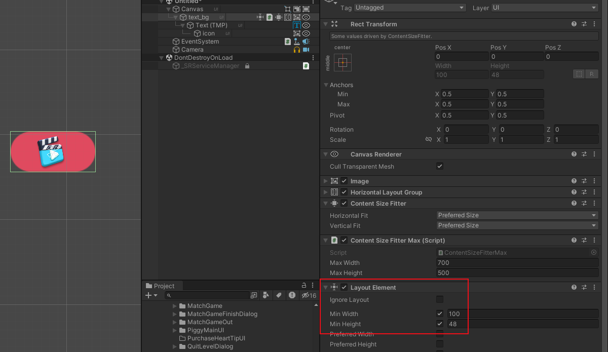

<h1 align=center>ContentSizeFitterMax</h1>

## 目录
- [目录](#目录)
- [一.需求](#一需求)
- [二.初步实现](#二初步实现)
- [三.最终实现](#三最终实现)
- [四.最终效果](#四最终效果)
- [五.链接地址](#五链接地址)

## 一.需求

有时候会提到一种需求，文本背景要随着文本长度的不同自适应，而且文本过长的时候要控制其不会超出范围。

效果如下：


## 二.初步实现

文本背景适配文本长度变长可以通过Unity自带的组件HorizontalLayoutGroup加ContentSizeFitter来实现，涉及组件结构如下



实现效果如下



```
需要注意的是ContentSizeFitter组件在对TMP_Text生效时auto size的对象会通过最大尺寸来适配

所以TMP_Text在初始状态字体大小不要超过设置的最大尺寸
```


如果设置过大就会这样



## 三.最终实现

为了限制宽度范围编写了一小工具，ContentSizeFitterMax



和contentSizeFitter配套使用，继承了UIBehaviour
```
[RequireComponent(typeof(ContentSizeFitter))]
public class ContentSizeFitterMax : UIBehaviour
```

重写了UIBehaviour的OnRectTransformDimensionsChange方法，该方法会在RectTransform的尺寸发生变化时调用，可以根据外部设置的限制尺寸来修改变大后的值，使其不超过限制范围。
```
protected override void OnRectTransformDimensionsChange()
{
    if (mRectTransform == null || mContentSizeFitter == null)
    {
        return;
    }
    Vector2 sizeDelta = mRectTransform.sizeDelta;
    if (maxWidth > 0)
    {
        if (mRectTransform.sizeDelta.x > maxWidth)
        {
            sizeDelta.x = maxWidth;
        }
    }
    if (maxHeight > 0)
    {
        if (mRectTransform.sizeDelta.y > maxHeight)
        {
            sizeDelta.y = maxHeight;
        }
    }
    mRectTransform.sizeDelta = sizeDelta;
}
```

## 四.最终效果


背景图的最小尺寸可以直接使用LayoutElement组件来实现



## 五.链接地址

   [https://github.com/jiumingxia/MBO/tree/main/%E5%88%86%E4%BA%AB/10%E6%9C%88%E5%88%86%E4%BA%AB/2.UI%E8%87%AA%E9%80%82%E5%BA%94%E9%95%BF%E5%BA%A6%E9%99%90%E5%88%B6%E5%B7%A5%E5%85%B7](https://github.com/jiumingxia/MBO/tree/main/%E5%88%86%E4%BA%AB/10%E6%9C%88%E5%88%86%E4%BA%AB/2.UI%E8%87%AA%E9%80%82%E5%BA%94%E9%95%BF%E5%BA%A6%E9%99%90%E5%88%B6%E5%B7%A5%E5%85%B7)