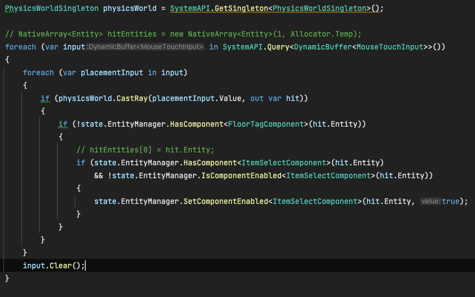

<h1 align=center>Dots游戏demo完善</h1>

## 目录
- [目录](#目录)
- [一. 创建地板标签组件区分射线点击的物品](#一-创建地板标签组件区分射线点击的物品)
- [二. 给物体创建选中管理组件](#二-给物体创建选中管理组件)
- [三. 创建一个系统管理被射线点击的物体，即ItemSelectComponent被激活的物体](#三-创建一个系统管理被射线点击的物体即itemselectcomponent被激活的物体)
- [四. 创建一个singleton组件来存储目标点位的坐标信息](#四-创建一个singleton组件来存储目标点位的坐标信息)
- [五. 创建选中物体移动控制系统](#五-创建选中物体移动控制系统)
- [六. 创建选中且集满3个的物体销毁的系统](#六-创建选中且集满3个的物体销毁的系统)
- [七. 最终效果](#七-最终效果)
- [八. 当前工程链接地址](#八-当前工程链接地址)


## 一. 创建地板标签组件区分射线点击的物品

1. 创建FloorTagComponent

    ```
    using Unity.Entities;
    public struct FloorTagComponent : IComponentData
    {
    
    }
    ```
2. 使用Authoring的方式，在baker的时候给Floor实体添加FloorTagComponent
   
    ```
    using Unity.Entities;
    using UnityEngine;

    public class FloorEntityAuthoring : MonoBehaviour
    {
        class Baker : Baker<FloorEntityAuthoring>
        {
            public override void Bake(FloorEntityAuthoring authoring)
            {
                var entity = GetEntity(TransformUsageFlags.Dynamic | TransformUsageFlags.NonUniformScale);
                AddComponent(entity, new FloorTagComponent());
            }
        }
    }
    ```

3. 在处理射线的system中添加条件过滤掉地板
   
    ```
    //单纯判断实体是否包含FloorTagComponent，在不含有的时候进行处理
    if (!state.EntityManager.HasComponent<FloorTagComponent>(hit.Entity))
    ```

    

## 二. 给物体创建选中管理组件

1. 创建一个可激活的组件，即继承IEnableableComponent接口，可以在选中是激活，未选中时默认不激活，根据激活状态射线也需要过滤激活的物品
   
    ```
    public struct ItemSelectComponent : IComponentData , IEnableableComponent { }

    //判断射线找到的实体是否包含ItemSelectComponent，组件的激活状态为false
    if (state.EntityManager.HasComponent<ItemSelectComponent>(hit.Entity) 
        && !state.EntityManager.IsComponentEnabled<ItemSelectComponent>(hit.Entity))
    ```

2. 给ItemSelectComponent组件添加需要的一些控制数据
   
    ```
    public struct ItemSelectComponent : IComponentData , IEnableableComponent
    {
        public int targetId;            // 收集的目标位置ID
        public int groupId;             // 道具分组，长得一样的道具为一组
        public int moveFinish;          // 是否位移完成
        public int waitDestroy;         // 是否处于等待销毁状态
        public int moveTotalTime;       // 移动的总时间（帧数）
        public int moveCurrentTime;     // 移动的当前帧数
        public float3 moveStartPos;     // 移动开始时的位置
        public float moveStartScale;    // 移动开始时的缩放
        public quaternion moveStartRot; // 移动开始时的旋转
    }
    ```

3. 在创建物体是绑定组件

    ```
    //在绑定的同时，同一类的物体设置同一个id
    state.EntityManager.AddComponentData(cube, new ItemSelectComponent(){groupId = 1});
    if (state.EntityManager.IsComponentEnabled<ItemSelectComponent>(cube))
    {
        //将激活状态设置为false，默认不激活等待射线点击
        state.EntityManager.SetComponentEnabled<ItemSelectComponent>(cube, false);
    }
    ```

4. 在射线点击时激活ItemSelectComponent

    ```
    state.EntityManager.SetComponentEnabled<ItemSelectComponent>(hit.Entity, true);
    ```

## 三. 创建一个系统管理被射线点击的物体，即ItemSelectComponent被激活的物体

1. 改脚本主要处理的事情就是给选中物体的身份状态添加标记，同时处理了收集物体数量满7个的逻辑，具体操作如下：
    1. 统计选中物体数量，并且分类统计每种物体的选中数量 (忽略待销毁物体)
    2. 设置没有目标点位的物体目标位置id (忽略待销毁物体)
    3. 在选中的物体数量等于7的时候移除所有的选中物体，并重置物体状态 (忽略待销毁物体)
    4. 根据分类统计数量判断收集到3个的物体，对这些选中物体标记待销毁
    5. 如果有选中物体被标记待销毁，重置选中物体的目标位置id为0，等待下一帧重新分配

```
using Unity.Mathematics;
using Unity.Physics;
using Unity.Transforms;

[BurstCompile]
public partial struct SelectItemSystem : ISystem
{
    private int mSelectItemCount;//当前选中物体计数

    [BurstCompile]
    public void OnUpdate(ref SystemState state)
    {
        int count = 0;
        //根据分组统计选中物体的数量,可选中物体的总数量
        NativeHashMap<int, int> groupEntitiesMap = new NativeHashMap<int, int>(6, Allocator.Temp);
        foreach (var itemSelect in SystemAPI.Query<RefRO<ItemSelectComponent>>())
        {
            if (itemSelect.ValueRO.waitDestroy == 0)
            {
                if (groupEntitiesMap.ContainsKey(itemSelect.ValueRO.groupId))
                {
                    groupEntitiesMap[itemSelect.ValueRO.groupId]++;
                }
                else
                {
                    groupEntitiesMap.Add(itemSelect.ValueRO.groupId, 1);
                }
                count++;
            }
        }
        //在当前选中物体计数发生变化时，重新设置选中物体的目标位置信息
        if (count != mSelectItemCount)
        {
            int indexOffset = 1;
            var entities = state.EntityManager.GetAllEntities();
            foreach (var entity in entities)
            {
                if (state.EntityManager.HasComponent<ItemSelectComponent>(entity))
                {
                    if (state.EntityManager.IsComponentEnabled<ItemSelectComponent>(entity))
                    {
                        var ItemSelect = SystemAPI.GetComponentRW<ItemSelectComponent>(entity);
                        //判断当前物体不是等待销毁状态，同时目标id为0表示需要设置目标位置
                        if (ItemSelect.ValueRO.targetId == 0 && ItemSelect.ValueRO.waitDestroy == 0)
                        {
                            //该处需要禁用物理效果，时间有限没有找到合适的方法，仅将质量设置为0不受重力影响
                            var physicsMass = SystemAPI.GetComponentRW<PhysicsMass>(entity);
                            physicsMass.ValueRW.InverseMass = 0;
                            ItemSelect.ValueRW.targetId = mSelectItemCount + indexOffset;
                            indexOffset++;
                        }
                    }
                }
            }
            mSelectItemCount = count;
        }

        // 处理下计数等于7的情况，将物体重置
        if (mSelectItemCount == 7)
        {
            var entities = state.EntityManager.GetAllEntities();
            foreach (var entity in entities)
            {
                if (state.EntityManager.HasComponent<ItemSelectComponent>(entity))
                {
                    if (state.EntityManager.IsComponentEnabled<ItemSelectComponent>(entity))
                    {
                        var ItemSelect = SystemAPI.GetComponentRW<ItemSelectComponent>(entity);
                        if (ItemSelect.ValueRO.waitDestroy == 0)
                        {
                            ItemSelect.ValueRW.targetId = 0;
                            ItemSelect.ValueRW.moveTotalTime = 0;
                            var physicsMass = SystemAPI.GetComponentRW<PhysicsMass>(entity);
                            physicsMass.ValueRW.InverseMass = 0.25f;
                            var transform = SystemAPI.GetComponentRW<LocalTransform>(entity);
                            transform.ValueRW.Scale = 1;
                            transform.ValueRW.Position = new float3(0, mSelectItemCount + 10, 0);
                            mSelectItemCount--;
                        }
                        state.EntityManager.SetComponentEnabled<ItemSelectComponent>(entity, false);
                    }
                }
            }
        }
        
        //通过分组的计数，标记数量达到3个需要被销毁的物体
        int isDestroyItem = 0;
        foreach (var value in groupEntitiesMap)
        {
            if (value.Value == 3)
            {
                var entities = state.EntityManager.GetAllEntities();
                foreach (var entity in entities)
                {
                    if (state.EntityManager.HasComponent<ItemSelectComponent>(entity))
                    {
                        if (state.EntityManager.IsComponentEnabled<ItemSelectComponent>(entity))
                        {
                            var itemSelect = SystemAPI.GetComponentRW<ItemSelectComponent>(entity);
                            if (itemSelect.ValueRO.groupId == value.Key && itemSelect.ValueRO.waitDestroy == 0)
                            {
                                itemSelect.ValueRW.waitDestroy = 1;
                                mSelectItemCount = 0;
                                isDestroyItem = 1;
                            }
                        }
                    }
                }
            }
        }
        groupEntitiesMap.Dispose();

        //如果出现销毁的物体，需要重置其他选中物体的目标位置信息
        if (isDestroyItem == 1)
        {
            var entities = state.EntityManager.GetAllEntities();
            foreach (var entity in entities)
            {
                if (state.EntityManager.HasComponent<ItemSelectComponent>(entity))
                {
                    if (state.EntityManager.IsComponentEnabled<ItemSelectComponent>(entity))
                    {
                        var ItemSelect = SystemAPI.GetComponentRW<ItemSelectComponent>(entity);
                        if (ItemSelect.ValueRO.waitDestroy == 0)
                        {
                            ItemSelect.ValueRW.targetId = 0;
                            ItemSelect.ValueRW.moveFinish = 0;
                        }
                    }
                }
            }
        }
    }
}
```

## 四. 创建一个singleton组件来存储目标点位的坐标信息

1. 创建组件脚本

    * 目前理解的单例组件是只要保证word中只会存在一个的组件就是单例组件

    * 可以通过SystemAPI.GetSingleton<GameCtrlSingletonComponent>()来获取，

    * 如果出现多个组件上面的方法会报错

    ```
    public struct GameCtrlSingletonComponent : IComponentData
    {
        public float3 selectPos1;
        public float3 selectPos2;
        public float3 selectPos3;
        public float3 selectPos4;
        public float3 selectPos5;
        public float3 selectPos6;
        public float3 selectPos7;
        public int gameState;
    }
    ```

2. 通过baker创建实体绑定组件并赋值
   
    ```
    public class SelectPosSingletonAuthoring : MonoBehaviour
    {
        public Transform[] selectPosTransArr;

        public static SelectPosSingletonAuthoring instance;

        private void Awake()
        {
            if (instance == null)
            {
                instance = this;
                DontDestroyOnLoad(gameObject);
            }
            else
            {
                Destroy(gameObject);
            }
        }

        class Baker : Baker<SelectPosSingletonAuthoring>
        {
            public override void Bake(SelectPosSingletonAuthoring authoring)
            {
                var entity = GetEntity(TransformUsageFlags.None);
                var data = new GameCtrlSingletonComponent();
                data.selectPos1 = authoring.selectPosTransArr[0].position;
                data.selectPos2 = authoring.selectPosTransArr[1].position;
                data.selectPos3 = authoring.selectPosTransArr[2].position;
                data.selectPos4 = authoring.selectPosTransArr[3].position;
                data.selectPos5 = authoring.selectPosTransArr[4].position;
                data.selectPos6 = authoring.selectPosTransArr[5].position;
                data.selectPos7 = authoring.selectPosTransArr[6].position;
                AddComponent(entity, data);
            }
        }
    }
    ```

## 五. 创建选中物体移动控制系统

1. 该系统只控制物体的移动，首先判断需要移动的物体
2. 确定目标位置
3. 初始帧设置移动总时间（帧数），同时设置开始坐标旋转缩放等信息
4. 根据当前帧数和总帧数确定移动插值
5. 当到达位置时标记移动状态为1，同时重置总时间信息方便下次移动，（额外控制了下物理速度组件，因为没有找到合适的禁用物理方法）

```
[BurstCompile]
public partial struct SelectItemMoveSystem : ISystem
{
    [BurstCompile]
    public void OnUpdate(ref SystemState state)
    {
        var entities = state.EntityManager.GetAllEntities();
        foreach (var entity in entities)
        {
            if (state.EntityManager.HasComponent<ItemSelectComponent>(entity))
            {
                if (state.EntityManager.IsComponentEnabled<ItemSelectComponent>(entity))
                {
                    var itemSelect = SystemAPI.GetComponentRW<ItemSelectComponent>(entity);
                    int targetId = itemSelect.ValueRO.targetId;
                    int isFinish = itemSelect.ValueRO.moveFinish;
                    //只控制目标位置不为零，切没有移动完成的实体
                    if (targetId != 0 && isFinish == 0)
                    {
                        //根据targetId设置目标位置
                        float3 targetPos = float3.zero;
                        var selectPos = SystemAPI.GetSingleton<GameCtrlSingletonComponent>();
                        switch (targetId)
                        {
                            case 1:
                                targetPos = selectPos.selectPos1;
                                break;
                            case 2:
                                targetPos = selectPos.selectPos2;
                                break;
                            case 3:
                                targetPos = selectPos.selectPos3;
                                break;
                            case 4:
                                targetPos = selectPos.selectPos4;
                                break;
                            case 5:
                                targetPos = selectPos.selectPos5;
                                break;
                            case 6:
                                targetPos = selectPos.selectPos6;
                                break;
                            case 7:
                                targetPos = selectPos.selectPos7;
                                break;
                        }

                        // 控制物体移动
                        var transform = SystemAPI.GetComponentRW<LocalTransform>(entity);
                        if (itemSelect.ValueRO.moveTotalTime == 0)
                        {
                            // 设置移动相关的初始信息
                            itemSelect.ValueRW.moveTotalTime = 30;
                            itemSelect.ValueRW.moveCurrentTime = 1;
                            itemSelect.ValueRW.moveStartPos = transform.ValueRO.Position;
                            itemSelect.ValueRW.moveStartScale = transform.ValueRO.Scale;
                            itemSelect.ValueRW.moveStartRot = transform.ValueRO.Rotation;
                        }
                        else
                        {
                            // 移动帧数累加
                            itemSelect.ValueRW.moveCurrentTime++;
                        }

                        // 根据当前帧数计数移动比例，设置物体transform信息
                        float ratio = itemSelect.ValueRO.moveCurrentTime / (float)itemSelect.ValueRO.moveTotalTime;
                        transform.ValueRW.Position = math.lerp(itemSelect.ValueRO.moveStartPos, targetPos, ratio);
                        transform.ValueRW.Scale = math.lerp(itemSelect.ValueRO.moveStartScale, 0.2f, ratio);
                        transform.ValueRW.Rotation = math.nlerp(itemSelect.ValueRO.moveStartRot, quaternion.identity, ratio);
                        if (ratio == 1)
                        {
                            // 移动完成，标记移动结束，重置状态
                            itemSelect.ValueRW.moveFinish = 1;
                            itemSelect.ValueRW.moveTotalTime = 0;
                            transform.ValueRW.Position = targetPos;
                            transform.ValueRW.Scale = 0.2f;
                            transform.ValueRW.Rotation = quaternion.identity;
                            var velocity = SystemAPI.GetComponentRW<PhysicsVelocity>(entity);
                            velocity.ValueRW.Angular = float3.zero;
                            velocity.ValueRW.Linear = float3.zero;
                        }
                    }
                }
            }
        }
    }
}
```

## 六. 创建选中且集满3个的物体销毁的系统

1. 只用来控制集满的物体的销毁

    * 控制销毁需要满足，控制组件被激活，待销毁状态被标记，且移动完成
    * 同时该状态物体的种类数量大于等于3

```
[BurstCompile]
public partial struct DestoryItemSystem : ISystem
{
    [BurstCompile]
    public void OnUpdate(ref SystemState state)
    {
        // 按分类统计待销毁且移动完成的物体
        NativeHashMap<int, int> moveFinishMap = new NativeHashMap<int, int>(6, Allocator.Temp);
        var entities = state.EntityManager.GetAllEntities();
        foreach (var entity in entities)
        {
            if (state.EntityManager.HasComponent<ItemSelectComponent>(entity))
            {
                if (state.EntityManager.IsComponentEnabled<ItemSelectComponent>(entity))
                {
                    var ItemSelect = SystemAPI.GetComponentRW<ItemSelectComponent>(entity);
                    if (ItemSelect.ValueRO.waitDestroy == 1 && ItemSelect.ValueRO.moveFinish == 1)
                    {
                        if (moveFinishMap.ContainsKey(ItemSelect.ValueRO.groupId))
                        {
                            moveFinishMap[ItemSelect.ValueRO.groupId]++;
                        }
                        else
                        {
                            moveFinishMap.Add(ItemSelect.ValueRO.groupId, 1);
                        }
                    }
                }
            }
        }
        foreach (var data in moveFinishMap)
        {
            if (data.Value >= 3)
            {
                // 这里控制销毁的物体数量是3的倍数
                int destroyCount = data.Value / 3 * 3;
                NativeArray<Entity> destroyArr = new NativeArray<Entity>(destroyCount, Allocator.Temp);
                foreach (var entity in entities)
                {
                    if (state.EntityManager.HasComponent<ItemSelectComponent>(entity))
                    {
                        if (state.EntityManager.IsComponentEnabled<ItemSelectComponent>(entity))
                        {
                            var itemSelect = state.EntityManager.GetComponentData<ItemSelectComponent>(entity);
                            if (itemSelect.waitDestroy == 1 && itemSelect.moveFinish == 1 && itemSelect.groupId == data.Key)
                            {
                                // 可销毁的物体添加到待销毁的临时数组中
                                destroyArr[destroyArr.Length - destroyCount] = entity;
                                destroyCount--;
                                if (destroyCount == 0)
                                {
                                    break;
                                }
                            }
                        }
                    }
                }
                // 销毁获取的物体数组
                state.EntityManager.DestroyEntity(destroyArr);
                destroyArr.Dispose();
            }
        }
        moveFinishMap.Dispose();
    }
}
```

## 七. 最终效果


## 八. 当前工程链接地址

   [https://github.com/jiumingxia/MBO/tree/main/DOTS](https://github.com/jiumingxia/MBO/tree/main/DOTS)