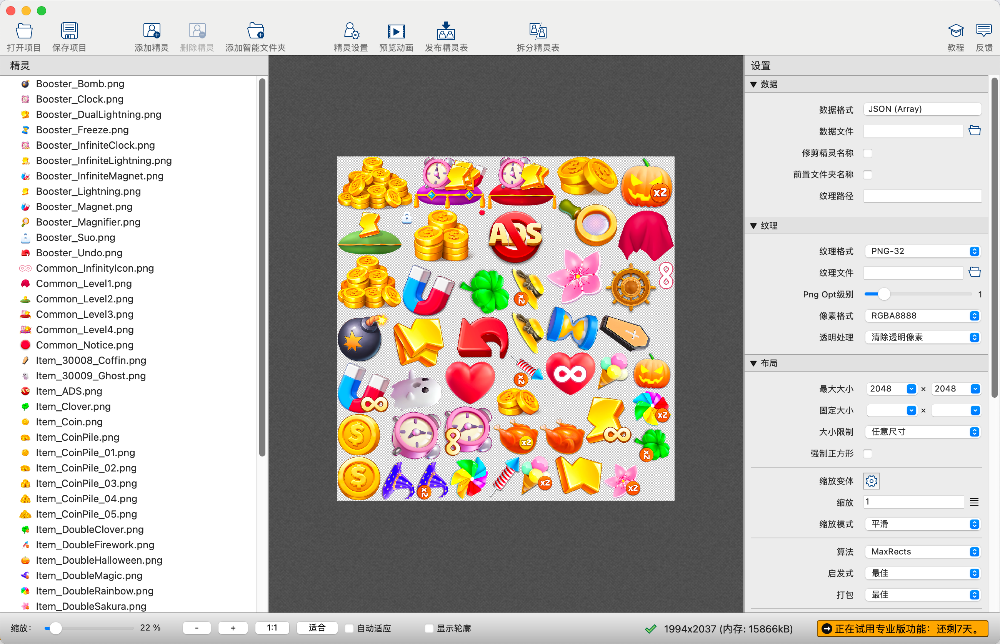
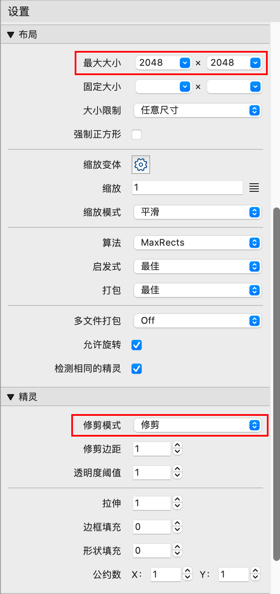

<h1 align=center>图文混排实现方案</h1>

## 目录
- [目录](#目录)
- [一. 使用TexturePacker工具](#一-使用texturepacker工具)
- [二. 直接选择图片创建SpriteAsset](#二-直接选择图片创建spriteasset)
- [三. 当前工程链接地址](#三-当前工程链接地址)

## 一. 使用TexturePacker工具

1. 首先需要下载TexturePacker
   
   1. 链接地址：[https://www.codeandweb.com/texturepacker](https://www.codeandweb.com/texturepacker)

2. 将需要进行图文混排的图片导入TexturePacker
   
   

3. 选择数据格式为：JSON(Array)
   
   

4. 设置其他属性，注意修剪模式不要选择多边形
   
   

5. 发布精灵表
   
   

6. 在Unity中生成TMP_Text可用的SpriteAsset文件
   
    

7. 调整图片位置
   
   

8. 在TMP_Text中设置SpriteAsset文件，可根据id使用<sprite=id>直接显示图片，id为json文件的Array顺序，从0开始
   
   

## 二. 直接选择图片创建SpriteAsset

1. 选中需要混排的图片，右键Create->TextMeshPro->SpriteAsset
   
   

2. 一样需要调整图片的位置
   
   

3. 直接使用<sprite=0>来显示图片，根据要显示的图片设置对应的SpriteAsset文件
   
   

4. 如果是单个的图片那么这种做出的SpriteAsset文件就只包含一个图片，也可以用一张包含很多图片的整图，切成多个Sprite集合来用上面的方法生成SpriteAsset文件。
   
   

## 三. 当前工程链接地址

   [https://github.com/jiumingxia/MBO/tree/main/%E5%9B%BE%E6%96%87%E6%B7%B7%E6%8E%92](https://github.com/jiumingxia/MBO/tree/main/%E5%9B%BE%E6%96%87%E6%B7%B7%E6%8E%92)